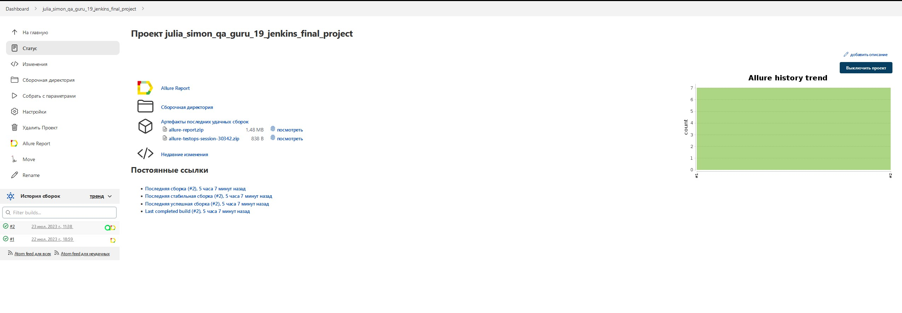
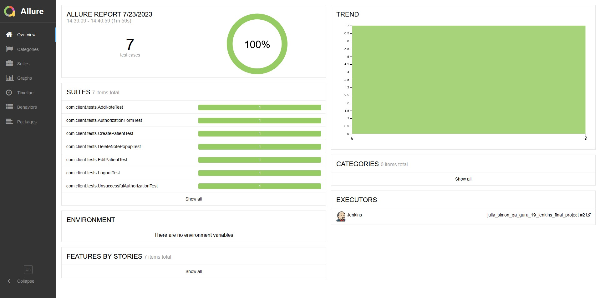
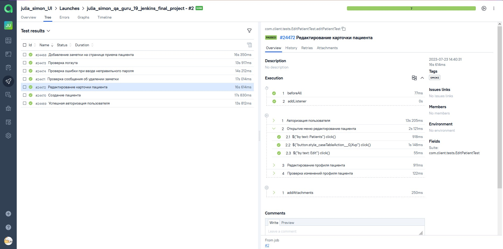
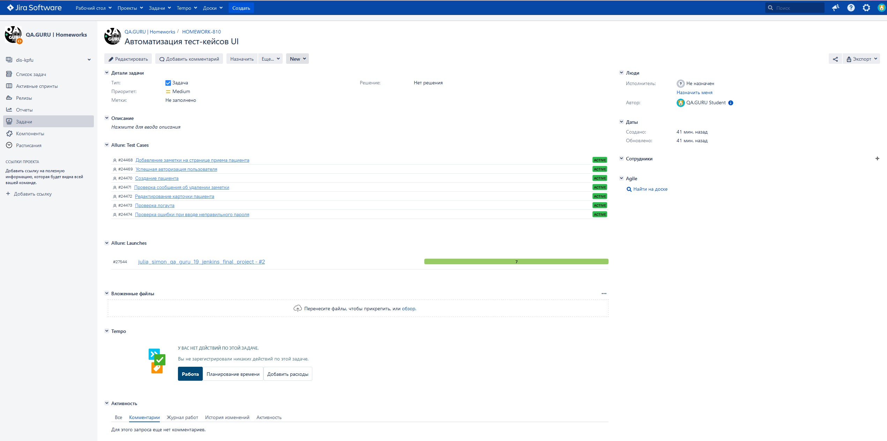
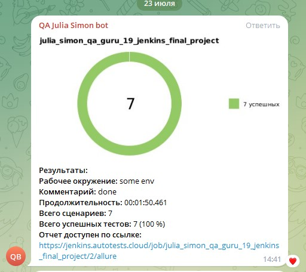

## Автотесты для компании Remedy Logic 
<p align="center">
  
</p>

<a name="Ссылка"></a>
## Содержание

- <a href="#tools">Стек технологий</a>
- <a href="#tests">Список тест-кейсов</a>
- <a href="#run">Команда для запуск тестов локально</a>
- <a href="#remote">Команда для запуска тестов удаленно</a>
- <a href="#jenkins-report">Сборка в Jenkins</a>
- <a href="#allure-report">Пример отчета о прохожлении тестирования в Allure Report</a>
- <a href="#allure-testops">Интеграция с Allure TestOps</a>
- <a href="#jira">Интеграция с Jira</a>
- <a href="#telegram">Уведомления в Telegram</a>
- <a href="#selenoid">Пример видео запуска теста в Selenoid</a>


<a id="tools"></a>
## :computer: Stack of technologies

<p  align="center">

<code></code>
<code></code>
<code></code>
<code></code>
<code></code>
<code></code>
<code></code>
<code></code>
<code></code>
<code></code>
<code></code>
<code></code>
</p>

<a id="tests"></a>
## :bookmark_tabs: Список тест-кейсов:

- [x] Успешная авторизация пользователя
- [x] Проверка ошибки при вводе неправильного пароля
- [x] Проверка логаута
- [x] Создание пациента
- [x] Редактирование карточки пациента
- [x] Добавление заметки на странице приема пациента
- [x] Проверка сообщения об удалении заметки


<a id="run"></a>
## :computer: Команда для запуск тестов локально

```bash
gradle clean smoke_test
```

<a id="remote"></a>
## :computer: Команда для запуска тестов удаленно

```bash
clean
smoke_test
-Dremote=${REMOTE}
-DbaseUrl=${BASE_URL}
-Dbrowser=${BROWSER}
-DbrowserSize=${BROWSER_SIZE}
```

<a id="jenkins-report"></a>
##  Сборка в [Jenkins](https://jenkins.autotests.cloud/job/julia_simon_qa_guru_19_jenkins_final_project/)

Для запуска сборки в Jenkins необходим перейти в сборку и нажать кнопку <code><strong>*Собрать с параметрами*</strong></code>, выбрать необходимые параметры и нажать кнопку <code><strong>*Собрать*</strong></code>.
Когда сборка будет завершена, станет доступен отчет Allure.

<p align="center">
  
</p>


<a id="allure-report"></a>
##  Пример отчета о прохожлении тестирования в [Allure Report](https://jenkins.autotests.cloud/job/julia_simon_qa_guru_19_jenkins_final_project/allure/)

Из <code><strong>Jenkins</strong></code> можно перейти в отчет сгенерированный с помощью <code><strong>Allure</strong></code>

<p align="center">
  
</p>

<a id="allure-testops"></a>
##  Интеграция с [Allure TestOps](https://allure.autotests.cloud/project/3552/dashboards)

## Тест-кейсы

<p align="center">
  
</p>

<a id="jira"></a>
##  Интеграция с [Jira](https://jira.autotests.cloud/browse/HOMEWORK-810)

<p align="center">
  
</p>

<a id="telegram"></a>
##  Уведомления в Telegram
После завершения тестирования отчет о результатах автоматически отправляется <code>Telegram</code> канал

<p align="center">

</p>


<a id="selenoid"></a>
##  Пример видео запуска теста в Selenoid
После прохождения тестов в отчете доступно видео.

<p align="center">
  
</p>

[Вернуться к оглавлению ⬆](#Ссылка)
